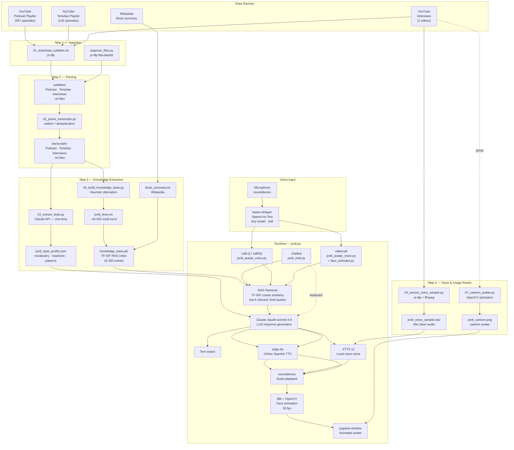

# The Wild Project — Jordi Wild Avatar

A conversational AI avatar of Jordi Wild, host of *The Wild Project* podcast. Built entirely from his public podcast transcripts, it can hold interviews in his style via text, voice, or animated video.

---

## Quick Start

```bash
# Set your Anthropic API key
echo "ANTHROPIC_API_KEY=sk-ant-..." > .env

# Launch the avatar (interactive mode selector)
python3 jordi.py
```

---

## Interaction Modes

| Mode | Input | Output | Notes |
|------|-------|--------|-------|
| `chatbot` | Keyboard | Text | No audio, fastest |
| `callLQ` | Microphone | Voice (online TTS) | ~2s latency |
| `callHQ` | Microphone | Voice (cloned, local) | Slow on CPU |
| `videocall` | Microphone | Animated face + voice | Needs photo |

```bash
python3 jordi.py --mode chatbot --topic "inteligencia artificial"
python3 jordi.py --mode videocall --photo jordi_cartoon.png
```

---

## Data Processing Pipeline

### Overview



### Step-by-step description

#### Step 1 — Ingestion (`01_download_subtitles.sh`, `organize_files.py`)
`yt-dlp` downloads auto-generated Spanish subtitles (`.vtt` files) from three YouTube sources without downloading video. `organize_files.py` then queries each playlist's metadata to sort files into `subtitles/Podcast/`, `subtitles/Tertulias/`, and `subtitles/Interviews/`.

#### Step 2 — Parsing (`02_parse_transcripts.py`)
YouTube auto-captions accumulate words incrementally within each utterance, producing hundreds of overlapping entries per episode (e.g. `"Oye tío"` → `"Oye tío, esto"` → `"Oye tío, esto es bestial"`). The parser collapses these using a suffix-overlap deduplication algorithm, then joins short fragments into full sentences. Output: one `.txt` file per episode in `transcripts/`.

#### Step 3 — Knowledge Extraction
Two parallel processes:

- **Heuristic diarization** (`06_build_knowledge_base.py`): Extracts Jordi's turns from transcripts using rule-based matching — questions ending in `?`, short reactions (`ajá`, `guau`, `claro`…), and known interviewer openers. Processes all 367 transcripts in seconds, zero API calls. Produces ~16,000 Jordi lines which are indexed into a TF-IDF knowledge base for RAG retrieval.

- **Style profile** (`03_extract_style.py`): A one-time Claude API call on a sample of episodes produces `jordi_style_profile.json` — vocabulary, reaction patterns, challenge strategies, humor style, sample questions. This is the only step that requires the Claude API for data processing.

#### Step 4 — Voice & Image Assets
- `04_extract_voice_sample.py`: Downloads audio from one episode, skips the intro, and extracts 45 seconds of clean Jordi speech for voice cloning.
- `07_cartoon_avatar.py`: Converts a portrait photo into a cartoon-style avatar using OpenCV bilateral filtering + adaptive edge detection + k-means color quantization.

#### Runtime
Every conversation turn follows this sequence:
1. **User input**: keyboard text or microphone (recorded via `sounddevice`, transcribed by `faster-whisper`)
2. **RAG retrieval**: the user's message is vectorized and compared against the knowledge base; the top-6 most similar real Jordi quotes are retrieved
3. **LLM generation**: Claude receives the style profile, retrieved quotes, conversation history, and content safety policy; generates a response grounded in Jordi's real speech
4. **Output**: text, speech synthesis (edge-tts or XTTS v2), or animated face driven by audio amplitude

---

## Libraries & AI Technologies

### Data Collection & Processing

| Library | Role | Notes |
|---------|------|-------|
| **yt-dlp** | Download subtitles from YouTube | No video download; uses `--flat-playlist` for metadata-only queries |
| **webvtt-py** | Parse `.vtt` subtitle files | Reads timed caption entries including overlapping auto-captions |
| **ffmpeg** | Audio extraction & conversion | Trims audio, resamples to 22 050 Hz mono WAV for TTS voice cloning |
| **scikit-learn** | TF-IDF indexing | `TfidfVectorizer` + `cosine_similarity` for RAG retrieval |
| **numpy / scipy** | Audio array manipulation | Float32 audio buffers, WAV I/O |

### Generative AI — Large Language Model (LLM)

**Technology:** LLMs are large neural networks (Transformer architecture) trained on vast text corpora to predict and generate coherent text. Given a prompt (system instructions + conversation history), they produce contextually appropriate responses.

| Library | Role |
|---------|------|
| **anthropic** (Anthropic SDK) | Client for Claude claude-sonnet-4-6 API |

**Usage in this project:** Final response generation only. Claude receives a system prompt containing Jordi's style profile, retrieved real quotes (RAG context), and a content safety policy, then generates a response that mimics Jordi's conversational style while staying grounded in verified content.

### Retrieval-Augmented Generation (RAG)

**Technology:** RAG combines a retrieval step (finding relevant documents from a knowledge base) with a generation step (LLM). This prevents hallucination by giving the model real source material to draw from, making responses verifiable and grounded.

| Library | Role |
|---------|------|
| **scikit-learn** `TfidfVectorizer` | Builds the retrieval index from 16 300 Jordi quotes |
| **scikit-learn** `cosine_similarity` | Ranks retrieved quotes by relevance to the user's message |
| **pickle** | Serializes the TF-IDF matrix for fast loading |

**Usage in this project:** Before each Claude call, the user's message is vectorized with TF-IDF and the top-6 most semantically similar real Jordi quotes are injected into the context window. This means Jordi's answers are anchored to things he has actually said, not generic LLM output.

### Speech-to-Text (STT)

**Technology:** Automatic Speech Recognition (ASR) converts audio waveforms into text using sequence-to-sequence neural models. Modern systems use Transformer encoders to process mel-spectrograms and decoder attention to generate token sequences.

| Library | Role |
|---------|------|
| **faster-whisper** | Transcribes microphone input to Spanish text |
| **sounddevice** | Captures audio from microphone at 16 kHz |

**Usage in this project:** In `callLQ`, `callHQ`, and `videocall` modes, holding `SPACE` records microphone audio which is saved to a temporary WAV and transcribed by Whisper before being sent to Claude.

### Text-to-Speech (TTS) & Voice Cloning

**Technology:** TTS systems synthesize natural speech from text. Modern neural TTS uses autoregressive or flow-based architectures. Voice cloning extends this by conditioning synthesis on a reference audio sample, reproducing the speaker's timbre, prosody, and accent.

| Library | Role |
|---------|------|
| **edge-tts** | Fast online TTS via Microsoft Azure neural voices |
| **coqui-tts** (XTTS v2) | Local voice cloning — synthesizes in Jordi's voice |

**Usage in this project:** `callLQ` and `videocall` use `edge-tts` (voice: `es-ES-AlvaroNeural`) for low-latency synthesis (~0.5 s). `callHQ` uses XTTS v2 conditioned on `jordi_voice_sample.wav` to reproduce Jordi's actual voice (~20–30 s on CPU).

### Computer Vision — Face Detection & Animation

**Technology:** Face landmark detection locates semantic points on a face (eyes, nose, mouth corners, jaw) using either classical regression trees over HOG features or modern CNNs. The detected points drive real-time deformation of the face image (warping, blending) synchronized with audio.

| Library | Role |
|---------|------|
| **dlib** | 68-point facial landmark detection |
| **opencv-python** | Image warping, bilateral filter, cartoon stylization, BGR↔RGB |
| **pygame** | Renders the animated avatar window at 30 fps |

**Usage in this project:** `face_animator.py` runs dlib's landmark detector once on Jordi's photo, then each frame shifts mouth-region pixels up/down proportional to audio amplitude, overlays a skin-colored eyelid for blinking, and applies a subtle rotation for head bob — all in pure CPU at ~30 fps.

---

## ML Models

### 1. Whisper (via faster-whisper)

| Property | Value |
|----------|-------|
| **Task** | Automatic Speech Recognition (ASR) |
| **Architecture** | Encoder-Decoder Transformer |
| **Model size** | `tiny` (~75 MB) |
| **Quantization** | `int8` (halves memory, ~2× faster on CPU) |
| **Language** | Spanish (`es`) forced |
| **Device** | CPU |
| **Inference time** | ~2 s for a 5 s utterance on 8-core CPU |

**Why chosen:** Runs entirely locally with no API cost. The `tiny` model is the best tradeoff for CPU-only hardware: fast enough for conversational latency (~2 s), accurate enough for clear Spanish speech. The `int8` compute type further reduces memory footprint and speeds up CPU matrix multiplications without significant quality loss.

**Strengths:** Robust to accents, multilingual, open-source (MIT license), no internet required.

---

### 2. XTTS v2 (Coqui TTS)

| Property | Value |
|----------|-------|
| **Task** | Text-to-Speech with zero-shot voice cloning |
| **Architecture** | GPT-based autoregressive TTS with cross-attention voice conditioning |
| **Model size** | ~1.8 GB |
| **Voice reference** | `data/jordi_voice_sample.wav` (45 s, 22 050 Hz mono) |
| **Language** | `es` (Spanish) |
| **Device** | CPU (GPU strongly recommended) |
| **Inference time** | ~20–30 s per response on CPU |

**Why chosen:** Best open-source model for zero-shot voice cloning in Spanish. Unlike speaker-ID models that require retraining, XTTS v2 clones any voice from a single audio sample at inference time. Used only in `callHQ` mode; `callLQ` and `videocall` use `edge-tts` for speed.

**Strengths:** Zero-shot cloning, multilingual, runs locally (no API cost), high prosodic naturalness.

---

### 3. dlib `shape_predictor_68_face_landmarks`

| Property | Value |
|----------|-------|
| **Task** | 2D facial landmark detection |
| **Architecture** | Ensemble of Regression Trees (ERT) over HOG features |
| **Model size** | ~100 MB (`.dat` file) |
| **Input** | Grayscale face crop |
| **Output** | 68 (x, y) landmark coordinates |
| **Inference time** | <5 ms per frame on CPU |
| **Training data** | iBUG 300-W dataset |

**Why chosen:** Extremely fast on CPU (<5 ms/frame), no GPU required, robust to moderate head pose variation, well-maintained with a permissive license. Neural alternatives (MediaPipe 0.10+) dropped backward-compatible APIs and require model downloads with complex task configuration; dlib's API is stable and straightforward.

**Strengths:** Real-time on any CPU, proven accuracy on frontal/near-frontal faces, small runtime footprint.

**Key landmarks used:**
- `13` (upper inner lip), `14` (lower inner lip) → mouth open/close animation
- `36–41` (left eye), `42–47` (right eye) → eyelid blink
- Overall centroid → head bob rotation anchor

---

### 4. TF-IDF Knowledge Base (RAG retrieval)

| Property | Value |
|----------|-------|
| **Task** | Sparse vector retrieval for RAG |
| **Algorithm** | TF-IDF (Term Frequency–Inverse Document Frequency) |
| **Library** | scikit-learn `TfidfVectorizer` |
| **Vocabulary** | 20 000 features |
| **N-grams** | Unigrams + bigrams `(1, 2)` |
| **Accent handling** | `strip_accents="unicode"` |
| **Corpus size** | 16 300 entries (~16 000 Jordi lines + Wikipedia chunks) |
| **Similarity metric** | Cosine similarity |
| **Retrieved per query** | Top-6 (threshold > 0.05) |

**Why chosen:** TF-IDF has zero inference cost (pure matrix multiplication), requires no GPU, no API calls, and no neural embedding model. For a retrieval corpus of ~16 k short Spanish sentences, keyword overlap is sufficient to surface relevant quotes. A neural embedding model (e.g. `sentence-transformers`) would handle paraphrases better but adds ~400 MB and GPU dependency — unnecessary given the corpus characteristics.

**Configuration rationale:**
- `ngram_range=(1,2)`: Bigrams capture collocations like `"o sea"`, `"me parece"`, `"tío tío"` that are distinctive of Jordi's speech
- `max_features=20000`: Covers the full Spanish vocabulary of the corpus without sparse noise
- `strip_accents="unicode"`: Makes retrieval accent-insensitive (`"cómo"` matches `"como"`)
- Threshold `0.05`: Filters out near-zero-relevance results to avoid injecting unrelated quotes into context

---

### 5. Claude claude-sonnet-4-6 (LLM)

| Property | Value |
|----------|-------|
| **Task** | Conversational response generation |
| **Provider** | Anthropic API |
| **Context** | System prompt (style profile + RAG quotes + safety policy) + conversation history |
| **max_tokens** | 200–400 (short, conversational responses) |
| **Temperature** | Default (not set — Anthropic default ~1.0) |
| **Language** | Spanish |

**Why chosen:** Best available model for nuanced Spanish conversational generation. The style profile and RAG context are both injected into the system prompt so the model generates responses that are both stylistically consistent and factually grounded. API calls are limited strictly to response generation — all data processing uses heuristics and local models.

**Content safety policy (injected in system prompt):** The avatar is configured to give sincere, direct opinions on sensitive topics (religion, politics, migration, gender) while never attacking individuals or groups based on identity — consistent with how Jordi handles these topics publicly. The system is designed for open publication.

---

## Project Structure

```
Wild_project/
├── jordi.py                      # Main launcher (mode selector)
├── .env                          # API key (not committed)
│
├── 01_download_subtitles.sh      # yt-dlp: download .vtt files
├── 02_parse_transcripts.py       # VTT → clean .txt
├── 03_extract_style.py           # Claude API: build style profile (one-time)
├── 04_extract_voice_sample.py    # Extract 45s Jordi voice sample
├── 06_build_knowledge_base.py    # Heuristic diarization + TF-IDF index
├── 07_cartoon_avatar.py          # Photo → cartoon PNG
├── organize_files.py             # Sort files into Podcast/Tertulias/Interviews
├── mic_test.py                   # Microphone level diagnostic
│
├── avatar/
│   ├── jordi_chat.py             # Text chatbot with RAG
│   ├── jordi_avatar_voice.py     # Voice avatar (callLQ / callHQ / videocall)
│   ├── jordi_avatar.py           # Legacy text avatar
│   └── face_animator.py          # dlib landmark → real-time face animation
│
├── subtitles/
│   ├── Podcast/                  # 254 .vtt files
│   ├── Tertulias/                # 109 .vtt files
│   └── Interviews/               # 2 .vtt files
│
├── transcripts/
│   ├── Podcast/                  # 254 .txt files
│   ├── Tertulias/                # 109 .txt files
│   └── Interviews/               # 2 .txt files
│
└── data/
    ├── jordi_style_profile.json  # Vocabulary, reactions, patterns
    ├── jordi_lines.txt           # ~16 000 extracted Jordi turns
    ├── knowledge_base.pkl        # TF-IDF matrix + vectorizer
    ├── book_summary.txt          # Wikipedia: Así es la puta vida
    └── jordi_voice_sample.wav    # 45s reference audio for XTTS v2
```

---

## Setup

```bash
# 1. Clone / download the project
cd Wild_project

# 2. Install system dependencies
sudo apt-get install -y portaudio19-dev libportaudio2 ffmpeg

# 3. Install Python packages
pip install yt-dlp webvtt-py anthropic faster-whisper edge-tts \
            coqui-tts sounddevice pygame numpy scipy scikit-learn \
            opencv-python dlib python-dotenv

# 4. Set API key
echo "ANTHROPIC_API_KEY=sk-ant-..." > .env

# 5. Run the full data pipeline (one-time, ~5 min)
./01_download_subtitles.sh          # ~10 min, downloads 367 subtitle files
python3 02_parse_transcripts.py     # ~1 min, cleans all transcripts
python3 06_build_knowledge_base.py  # ~5 s, builds RAG index
python3 03_extract_style.py         # ~2 min, Claude API (one-time cost ~$0.10)

# Optional: voice cloning and cartoon avatar
python3 04_extract_voice_sample.py  # for callHQ mode
python3 07_cartoon_avatar.py        # for videocall mode

# 6. Launch
python3 jordi.py
```

---

## Hardware Notes

| Component | Minimum | Recommended |
|-----------|---------|-------------|
| RAM | 4 GB | 8 GB+ |
| CPU | 4 cores | 8 cores |
| GPU | Not required | NVIDIA GPU (for callHQ / real-time face video) |
| Disk | 3 GB (models + data) | 5 GB |
| Internet | Required for `chatbot`/`callLQ` (Claude + edge-tts) | — |

The project was built and tested on an AMD Ryzen with integrated Radeon Vega GPU (no CUDA). All ML inference runs on CPU.
